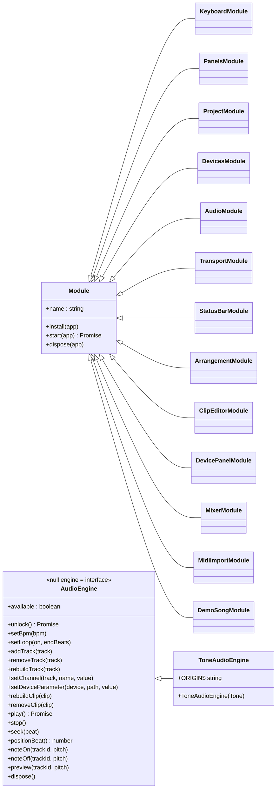
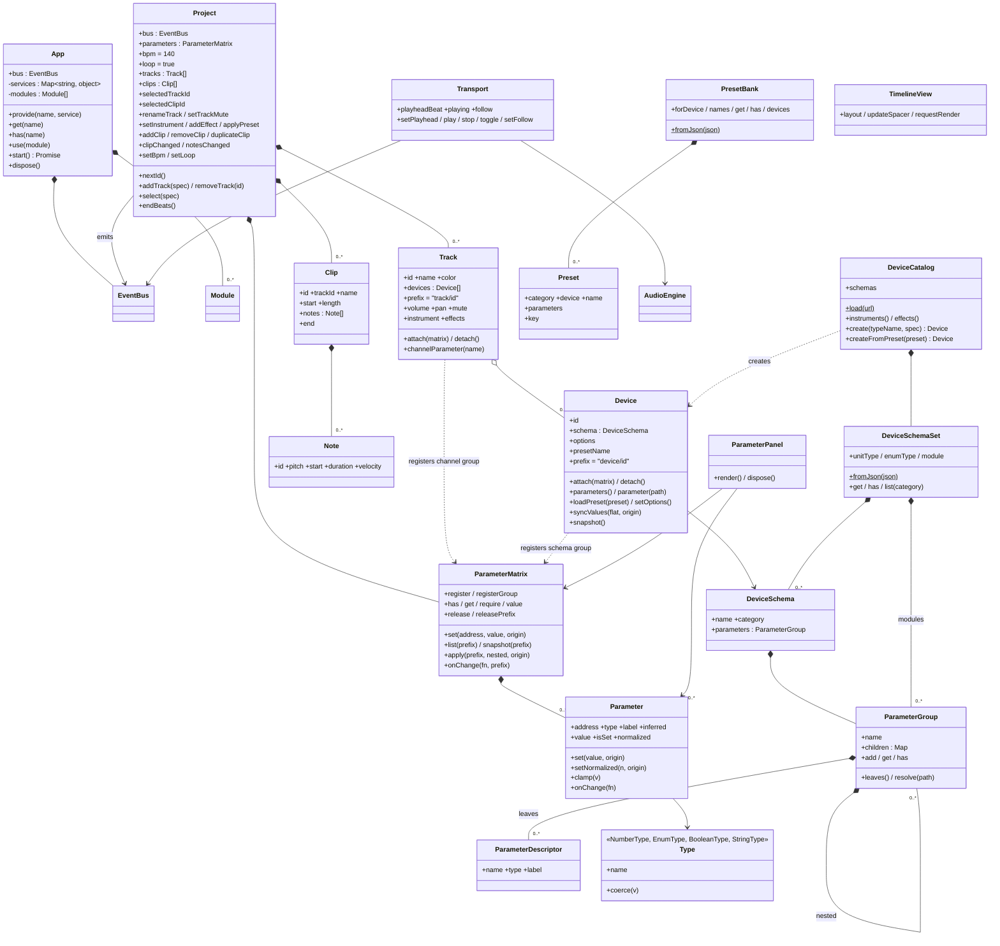
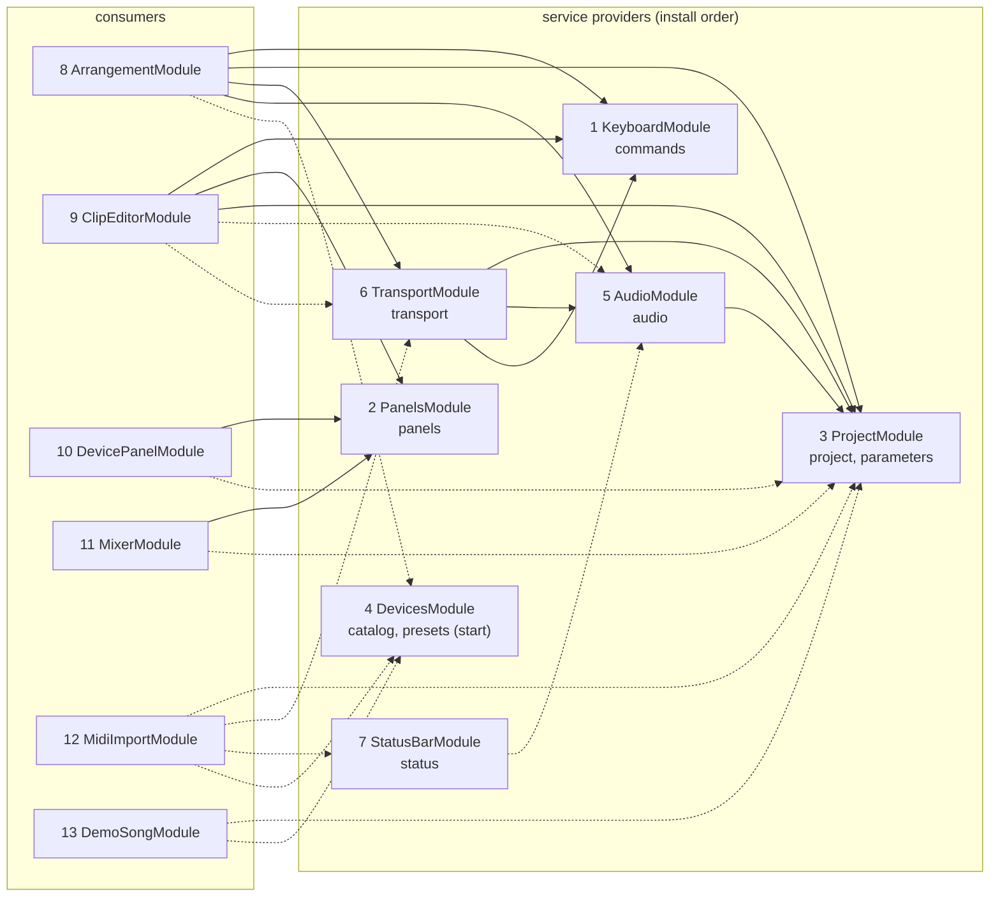
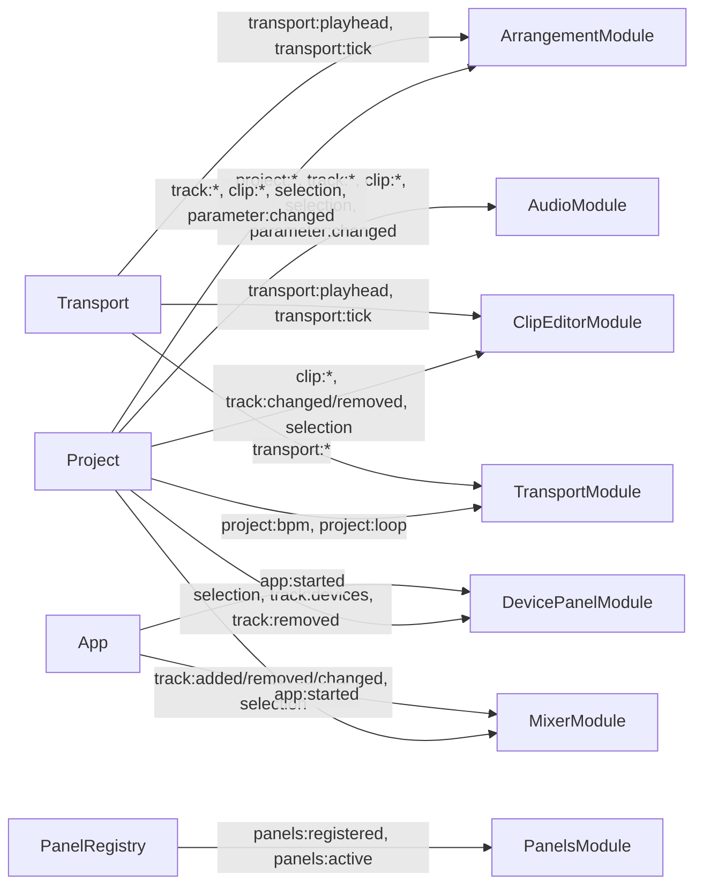
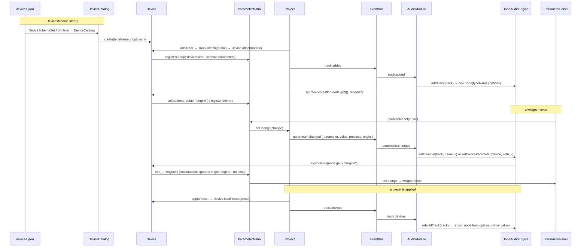

# DAWSome architecture

Component, inheritance and wiring diagrams of the code under `src/`, drawn from the source itself.
The [README](../README.md) tells the story; this file is the reference a scaffolding tool can be
built from. Every table and diagram below was checked against the `import`, `app.provide`,
`app.get`, `bus.on`, `bus.emit`, `commands.register` and `panels.register` calls in the code.

Contents

1. [Layers and import graph](#1-layers-and-import-graph)
2. [Inheritance](#2-inheritance)
3. [Domain composition](#3-domain-composition)
4. [Module wiring](#4-module-wiring)
5. [Bus events](#5-bus-events)
6. [Parameter data flow](#6-parameter-data-flow)
7. [Extension contract](#7-extension-contract)

## 1. Layers and import graph

Directories are layers. Imports only point downward: `core/` and `params/` import nothing outside
themselves, `util/` and `midi/` have no `src/` imports at all, and `model/`, `devices/`, `audio/`
and `ui/` never import a `*Module`. `src/main.js` is the only file that imports more than one
module.

```mermaid
flowchart TD
  main["src/main.js"]

  subgraph modules["src/modules/ (+ ProjectModule, DevicesModule, AudioModule in their domain dirs)"]
    KeyboardModule
    PanelsModule
    TransportModule
    StatusBarModule
    ArrangementModule
    ClipEditorModule
    DevicePanelModule
    MixerModule
    MidiImportModule
    DemoSongModule
  end

  subgraph core["src/core/"]
    App
    Module
    EventBus
    CommandRegistry
    PanelRegistry
  end

  subgraph model["src/model/"]
    ProjectModule
    Project
    Track
    Clip
    Note
  end

  subgraph devices["src/devices/"]
    DevicesModule
    DeviceCatalog
    Device
    DeviceSchema["DeviceSchema / DeviceSchemaSet"]
    PresetBank["PresetBank / Preset"]
    defaultDevices
  end

  subgraph audio["src/audio/"]
    AudioModule
    AudioEngine
    ToneAudioEngine
  end

  subgraph ui["src/ui/"]
    dom["dom.js ($, el, sizeCanvas, wheelDeltas)"]
    TimelineView
    ParameterPanel
  end

  subgraph params["src/params/"]
    ParameterMatrix
    Parameter
    ParameterGroup["ParameterGroup / ParameterDescriptor"]
    types["types.js (NumberType, EnumType, BooleanType, StringType)"]
    paths["paths.js"]
  end

  subgraph util["src/util/ and src/midi/"]
    music["music.js"]
    theme["theme.js"]
    SmfParser["midi/SmfParser.js"]
  end

  main --> App
  main --> modules
  main --> ProjectModule
  main --> DevicesModule
  main --> AudioModule

  App --> EventBus
  App --> Module

  modules --> Module
  KeyboardModule --> CommandRegistry
  PanelsModule --> PanelRegistry
  PanelsModule --> dom
  TransportModule --> dom
  TransportModule --> music
  StatusBarModule --> dom
  ArrangementModule --> dom
  ArrangementModule --> TimelineView
  ArrangementModule --> defaultDevices
  ArrangementModule --> music
  ArrangementModule --> theme
  ClipEditorModule --> dom
  ClipEditorModule --> TimelineView
  ClipEditorModule --> Note
  ClipEditorModule --> music
  ClipEditorModule --> theme
  DevicePanelModule --> dom
  DevicePanelModule --> ParameterPanel
  MixerModule --> dom
  MixerModule --> ParameterPanel
  MidiImportModule --> dom
  MidiImportModule --> SmfParser
  MidiImportModule --> Note
  MidiImportModule --> defaultDevices
  MidiImportModule --> music
  DemoSongModule --> Note
  DemoSongModule --> defaultDevices
  DemoSongModule --> music

  ProjectModule --> Module
  ProjectModule --> Project
  Project --> ParameterMatrix
  Project --> Track
  Project --> Clip
  Project --> music
  Track --> types
  Track --> ParameterGroup
  Note --> music

  DevicesModule --> Module
  DevicesModule --> DeviceCatalog
  DevicesModule --> PresetBank
  DeviceCatalog --> Device
  DeviceCatalog --> DeviceSchema
  Device --> DeviceSchema
  Device --> types
  Device --> paths
  DeviceSchema --> types
  DeviceSchema --> ParameterGroup

  AudioModule --> Module
  AudioModule --> AudioEngine
  AudioModule --> ToneAudioEngine
  AudioModule --> paths
  ToneAudioEngine --> AudioEngine
  ToneAudioEngine --> paths
  ToneAudioEngine --> music

  TimelineView --> dom
  TimelineView --> music
  TimelineView --> theme
  ParameterPanel --> dom

  ParameterMatrix --> Parameter
  ParameterMatrix --> paths
  Parameter --> paths
```

Outside `src/`: `index.html` is the shell markup (every element id the modules bind to),
`styles/app.css` the only stylesheet, `devices.json` and `preset-bank.json` the data files fetched
at start, `tools/serve.mjs` the static server, `tools/smoke.mjs` the headless browser check and
`test/*.test.mjs` the `node:test` unit tests. `webpack.config.js` bundles the same graph into
`dist/` for deployment; it reads `index.html` as its template and imports nothing from `src/`, so
no module knows whether it was bundled.

## 2. Inheritance

There are exactly two inheritance roots. Everything else is a standalone class.

| root | file | subclasses | how a subclass is picked up |
|---|---|---|---|
| `Module` | `src/core/Module.js` | 13, one per feature | passed to `app.use()` in `src/main.js` |
| `AudioEngine` | `src/audio/AudioEngine.js` | `ToneAudioEngine` | constructed in `AudioModule.install` when `globalThis.Tone` exists, else the null engine |

Standalone classes (no `extends`): `App`, `EventBus`, `CommandRegistry`, `PanelRegistry`,
`Project`, `Track`, `Clip`, `Note`, `Device`, `DeviceCatalog`, `DeviceSchema`, `DeviceSchemaSet`,
`Preset`, `PresetBank`, `Parameter`, `ParameterGroup`, `ParameterDescriptor`, `ParameterMatrix`,
`NumberType`, `EnumType`, `BooleanType`, `StringType`, `Transport`, `TimelineView`,
`ParameterPanel`. The four `*Type` classes share a duck-typed shape (`name`, `coerce`) but no
base class; `Parameter.clamp` probes for `type.clamp` before calling it.

## 3. Domain composition

Who owns what at run time. Solid diamonds are ownership (the owner creates or disposes the part),
plain arrows are references.

## 4. Module wiring

`src/main.js` installs the modules in the order below. `install()` runs immediately for each
`use()`, `start()` runs afterwards in the same order, `dispose()` in reverse. A module may only
`app.get()` a service provided by an earlier row; `catalog` and `presets` are provided in
`DevicesModule.start()`, so they can only be read in `start()` or later.

| # | Module | provides (phase) | `app.get` in `install` | `app.get` in `start` | commands | panel | bus subscriptions | DOM ids via `$()` / globals |
|---|---|---|---|---|---|---|---|---|
| 1 | `KeyboardModule` | `commands` (install) | – | – | – | – | – | `window` keydown, `document` click |
| 2 | `PanelsModule` | `panels` (install) | – | – | – | – | start: `panels:registered`, `panels:active` | `tabStrip`, `arrangement` |
| 3 | `ProjectModule` | `project`, `parameters` (install) | – | – | – | – | – | – |
| 4 | `DevicesModule` | `catalog`, `presets` (**start**) | – | – | – | – | – | `fetch("devices.json")`, `fetch("preset-bank.json")` |
| 5 | `AudioModule` | `audio` (install) | `project` | – | – | – | install: `track:added`, `track:removed`, `track:devices`, `clip:added`, `clip:changed`, `clip:notes`, `clip:removed`, `project:bpm`, `project:loop`, `parameter:changed` | `globalThis.Tone` (optional) |
| 6 | `TransportModule` | `transport` (install) | `project`, `audio`, `commands` | `project`, `audio` | `transport.toggle` (Space) | – | start: `transport:state`, `transport:playhead`, `transport:tick`, `transport:follow`, `project:bpm`, `project:loop` | `playBtn`, `posReadout`, `bpmInput`, `loopBtn`, `followBtn` |
| 7 | `StatusBarModule` | `status` (install) | – | `audio` | – | – | – | `hint` |
| 8 | `ArrangementModule` | – | `commands`, `project`, `transport`, `audio` | `catalog`, `presets` | `track.add`, `clip.add`, `clip.duplicate` (Ctrl+D), `clip.delete` | – | start: `track:added`, `track:removed`, `track:changed`, `track:devices`, `clip:added`, `clip:removed`, `clip:changed`, `clip:notes`, `selection`, `parameter:changed` (only `track/…` addresses), `transport:playhead`, `transport:tick` | `trackHeaders`, `addTrackBtn`, `addClipBtn`, `dupClipBtn`, `delClipBtn`, `arrGridWrap`, `arrGridCanvas`, `arrRulerWrap`, `arrRulerCanvas`, `arrScroller`, `arrSpacer`, `arrZoomInH`, `arrZoomOutH`, `arrZoomInV`, `arrZoomOutV` |
| 9 | `ClipEditorModule` | – | `commands`, `panels`, `project` | `audio`, `transport` | `editor.toggleDraw` (B), `editor.clearSelection` (Escape), `editor.selectAll` (Ctrl+A), `editor.clearNotes`, `edit.delete` (Delete, Backspace) | `clip-editor` (install, `#clipEditorPanel`) | start: `selection`, `clip:changed`, `clip:removed`, `clip:notes`, `track:changed`, `track:removed`, `transport:playhead`, `transport:tick` | `clipEditorPanel`, `clipTitle`, `lenInput`, `gridSelect`, `tripletBtn`, `snapBtn`, `gridReadout`, `drawBtn`, `clearBtn`, `edGridWrap`, `edGridCanvas`, `edRulerWrap`, `edRulerCanvas`, `edKeysWrap`, `edKeysCanvas`, `edScroller`, `edSpacer`, `edZoomInH`, `edZoomOutH`, `edZoomInV`, `edZoomOutV` |
| 10 | `DevicePanelModule` | – | `panels` | `project`, `parameters` | – | `devices` (install, `#devicesPanel`) | start: `selection`, `track:devices`, `track:removed`, `app:started` | `devicesPanel` |
| 11 | `MixerModule` | – | `panels` | `project`, `parameters` | – | `mixer` (install, `#mixerPanel`) | start: `track:added`, `track:removed`, `track:changed`, `app:started`, `selection` | `mixerPanel` |
| 12 | `MidiImportModule` | – | – | `project`, `transport`, `status`, `catalog` | – | – | – | `importBtn`, `midiFile` |
| 13 | `DemoSongModule` | – | – | `project`, `catalog` | – | – | – | – |

Service dependency graph. Solid arrows are `app.get` calls made in `install()`, dashed arrows
are `app.get` calls made in `start()`. Every arrow points to a module with a lower number.

Registries. `CommandRegistry` (`src/core/CommandRegistry.js`) and `PanelRegistry`
(`src/core/PanelRegistry.js`) are the two plug-in points besides services. Both throw on a
duplicate id and both `register()` calls return the matching unregister function.

| registry | entry shape | consumers of the registry |
|---|---|---|
| `commands` | `{ id, title, run, shortcut?, when? }` | `KeyboardModule` (`matchShortcut` on keydown), toolbar buttons (`commands.run(id)`) |
| `panels` | `{ id, title, element }` | `PanelsModule` (tab strip, show/hide, resizes `#arrangement`) |

## 5. Bus events

One `EventBus` instance, owned by `App`, synchronous `emit`. Only four classes emit.

| event | payload | emitter | listeners (module) |
|---|---|---|---|
| `project:bpm` | `{ bpm }` | `Project.setBpm` | Audio, Transport |
| `project:loop` | `{ loop }` | `Project.setLoop` | Audio, Transport |
| `track:added` | `{ track }` | `Project.addTrack` | Audio, Arrangement, Mixer |
| `track:removed` | `{ track }` | `Project.removeTrack` | Audio, Arrangement, ClipEditor, DevicePanel, Mixer |
| `track:changed` | `{ track }` | `Project.renameTrack` | Arrangement, ClipEditor, Mixer |
| `track:devices` | `{ track }` | `Project.setInstrument`, `addEffect`, `applyPreset` | Audio, Arrangement, DevicePanel |
| `clip:added` | `{ clip }` | `Project.addClip` | Audio, Arrangement |
| `clip:removed` | `{ clip }` | `Project.removeClip` | Audio, Arrangement, ClipEditor |
| `clip:changed` | `{ clip }` | `Project.clipChanged` | Audio, Arrangement, ClipEditor |
| `clip:notes` | `{ clip }` | `Project.notesChanged` | Audio, Arrangement, ClipEditor |
| `selection` | `{ trackId, clipId, previousTrackId, previousClipId }` | `Project.select` | Arrangement, ClipEditor, DevicePanel, Mixer |
| `parameter:changed` | `{ parameter, value, previous, origin }` | `Project` (forwards `ParameterMatrix.onChange`) | Audio, Arrangement |
| `transport:playhead` | `{ beat }` | `Transport.setPlayhead` | Transport, Arrangement, ClipEditor |
| `transport:tick` | `{ beat }` | `Transport` (each frame while playing) | Transport, Arrangement, ClipEditor |
| `transport:state` | `{ playing }` | `Transport.play`, `stop` | Transport |
| `transport:follow` | `{ follow }` | `Transport.setFollow` | Transport |
| `panels:registered` | `{ id, title, element }` | `PanelRegistry.register` | Panels |
| `panels:active` | `{ id, previous }` | `PanelRegistry.show`, `hide` | Panels |
| `app:started` | the `App` | `App.start` | DevicePanel, Mixer |

## 6. Parameter data flow

Every live value is a `Parameter` in the one `ParameterMatrix` owned by `Project`. Addresses are
`track/<trackId>/{volume|pan|mute}` or `device/<deviceId>/<schema path>`. The matrix holds no DOM,
no Tone node and no bus reference; each side reaches it through its own path.

| origin | written by | effect |
|---|---|---|
| `"engine"` | `ToneAudioEngine` via `Device.syncValues` | `AudioModule` ignores it, so a value Tone converted cannot echo |
| `"ui"` | `ParameterPanel` widgets | routed to the engine |
| `"preset"` | preset application | routed to the engine |
| `null` | programmatic `set` | routed to the engine |

## 7. Extension contract

What a generator has to produce for each kind of expansion, with the file that is the template
today. The rules are the ones the code enforces (`App.provide` and both registries throw on
duplicates, `App.get` throws on a missing service, `$()` throws on a missing element).

### 7.1 A feature module

Template for the minimal shape: `src/modules/StatusBarModule.js`. Template for a panel module:
`src/modules/MixerModule.js`. Template for a module with commands and toolbar bindings:
`src/modules/TransportModule.js`.

1. `export class <Name>Module extends Module` in `src/modules/<Name>Module.js`. A module that
   owns a domain lives beside it instead, as `ProjectModule`, `DevicesModule` and `AudioModule` do.
2. State in `#private` fields. Keep every undo function (`bus.on`, `commands.register`,
   `panels.register` all return one; DOM listeners are recorded by hand) in one list and replay
   it in `dispose()`. Existing names for that list: `#unsubscribes`, `#cleanups`, `#subscriptions`,
   `#teardown`, `#off`.
3. `install(app)`: `app.provide()` any service it offers; `app.get()` only services from an
   earlier row of the table in §4; never `catalog` or `presets`; register commands and panels.
4. `start(app)`: bind DOM with `$()` from `src/ui/dom.js`, read late services, subscribe, render
   once. Modules that render from the model also subscribe to `app:started` when they need a
   redraw after `DemoSongModule` seeded the project.
5. Add the import and one `.use(new <Name>Module())` line to `src/main.js` after the last
   module it depends on and before `DemoSongModule`; extend the order comment there.
6. Every id bound with `$()` must exist in `index.html`, or the element is built with `el()`.
7. A panel is `{ id, title, element }`. `PanelsModule` adds the tab; `tools/smoke.mjs`
   `EXPECTED_TABS` must list the new title.
8. A command is `{ id: "<area>.<verb>", title, run, shortcut?, when? }`; ids are unique across
   the registry; shortcut syntax is `"Space"`, `"B"`, `"Escape"`, `"Delete"`, `"Ctrl+D"` or an
   array of those.
9. Update the README tables (services, bus events, commands, panels) and the table in §4.

### 7.2 A device

No code. Add an entry to the `devices` section of `devices.json`, keyed by the Tone.js class
name, with `type` `"Instrument"` or `"Effect"` and parameters as `unitTypes/…`, `enumTypes/…`,
`modules/…` or `devices/…` refs. Optional presets go in `preset-bank.json` under
`category\Device\Preset`. `test/devices.test.mjs` is where schema and bank checks live.

### 7.3 Another audio engine

Subclass `src/audio/AudioEngine.js` and override the methods listed in §2. Construct it in
`AudioModule.install` (`src/audio/AudioModule.js`), the only place a concrete engine is named.
Values mirrored back into the matrix must use an origin that `AudioModule.#applyParameter`
ignores; today that is `ToneAudioEngine.ORIGIN` (`"engine"`).

### 7.4 A track channel parameter

Extend `createChannelGroup()` and `CHANNEL_DEFAULTS` in `src/model/Track.js`. Handle the new name
in `ToneAudioEngine.setChannel`. The mixer lists `parameters.list(track.prefix)`, so the strip
gains the widget without a change to `MixerModule`. Add the case to `test/model.test.mjs`.

### 7.5 A bus event

Emit from the owner of the state (`Project` for model changes, the service for its own state),
with a one-object payload, and add it to the README table and §5. Listeners subscribe in
`start()` unless they must observe events fired during other modules' `start()`, as
`AudioModule` does in `install()`.

### 7.6 Tests

Unit tests are `test/<area>.test.mjs` using `node:test` and `node:assert/strict`, run by
`npm test`. They import model, params, devices and midi code directly; nothing in `test/` touches
the DOM or Tone. Browser-only modules are covered by `tools/smoke.mjs`.

### 7.7 Invariants a generator may assert

- Install order equals service-dependency order; an `app.get` in `install()` only names a service
  provided by an earlier `use()` line.
- `catalog` and `presets` are read in `start()` or later, never in `install()`.
- One bus, owned by `App`; no module constructs its own `EventBus`.
- A service name is provided once (`App.provide` throws on a repeat).
- Command ids and panel ids are unique (both registries throw on a repeat).
- `ParameterMatrix` references no DOM, no Tone node and no bus.
- The engine never reads the bus or the DOM; `AudioModule` is the only bridge.
- Every `install()`/`start()` side effect has an undo in `dispose()`.
